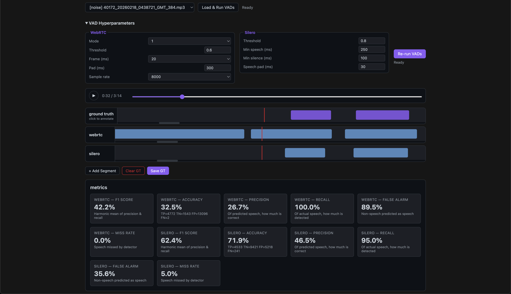

# VAD Visualizer

This is a tool to visualize and compare vad segments from different models. It has features like manual annotation of audio segments and comparison of vad segments from webrtc, silero, etc and evaluation of the results with metrics like precision, recall, f1-score. It also supports tuning VAD hypterparameters and finding the best hyperparameter for a noisy dataset



## How to the run the project

```bash
git clone git@prod-gitlab.sprinklr.com:darshan.makwana/vad_visualizer.git
curl -LsSf https://astral.sh/uv/install.sh | sh

./server
```